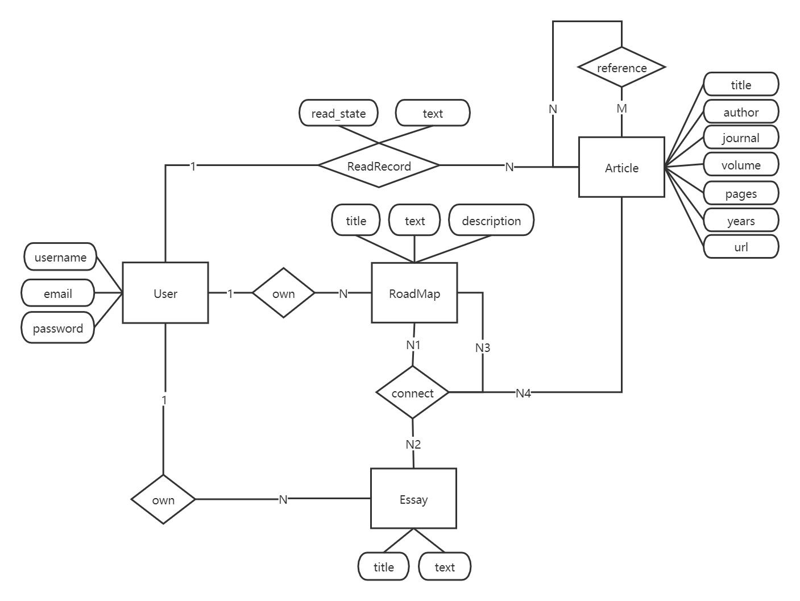

# Roadmap-Backend
> This is the backend part of Roadmap web app

## Getting Started
### Installation
`pip install -r requirements.txt`

## Entity Relationship Diagram

    

 

## Development

## API Rules

## Release History

